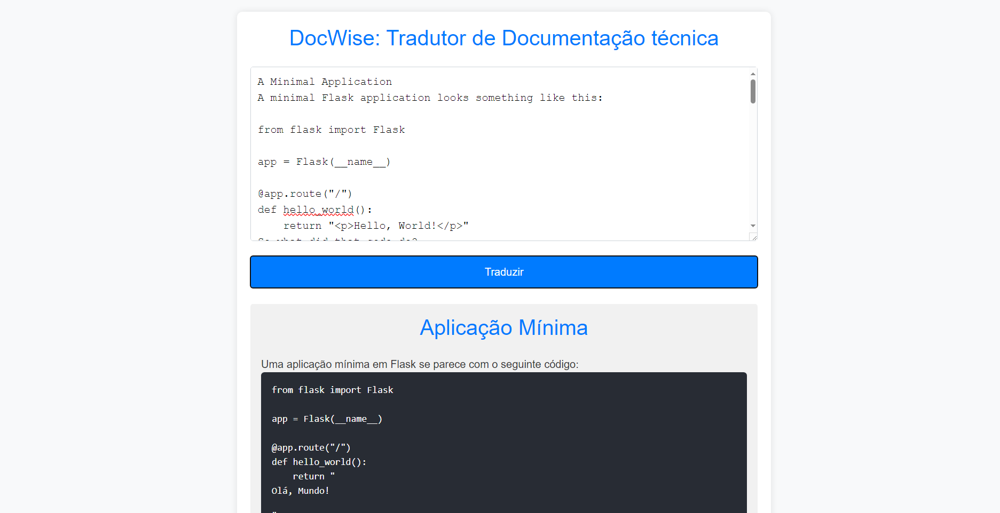

# DocWise

DocWise é uma ferramenta que traduz e explica documentações técnicas em inglês de maneira clara e acessível para desenvolvedores que falam português. Ele utiliza Flask para o backend e integra a API Groq com o modelo Llama para fornecer traduções adaptadas ao português brasileiro e explicações didáticas, formatadas em HTML para facilitar a visualização.



## Funcionalidades

- **Tradução de Documentação**: Traduz textos de documentação técnica em inglês para português brasileiro, garantindo coerência e clareza nas frases.
- **Explicação Didática**: Explica conceitos complexos de programação com exemplos práticos e analogias simples, visando a acessibilidade e o entendimento do usuário.
- **Formatação HTML**: Retorna as traduções e explicações já formatadas com tags HTML, como `<h1>` para títulos, `<h2>` para subtítulos, e `<pre>` para blocos de código, tornando a documentação mais organizada e fácil de visualizar.

## Tecnologias Utilizadas

- **Flask**: Framework Python utilizado para construir o backend da aplicação, gerenciando as rotas e os endpoints da API.
- **Groq API**: Biblioteca que permite a integração com modelos de IA avançados, como o Llama, para processamento e geração de texto.
- **Llama Model (Versão 3.1)**: Modelo de linguagem utilizado para traduzir e explicar conceitos técnicos, proporcionando respostas personalizadas e detalhadas.

## Como Funciona

1. O usuário envia um texto de documentação em inglês para ser traduzido.
2. A aplicação utiliza a API Groq para traduzir o texto, adaptando-o ao português brasileiro e formatando-o com tags HTML.
3. Caso o conceito ainda não seja claro, o usuário pode solicitar uma explicação mais detalhada. A IA então fornece uma explicação didática, usando exemplos e analogias para facilitar o entendimento.

## Como Executar o Projeto

1. **Clone o repositório**:
   
   ```bash
   git clone https://github.com/seuusuario/docwise.git
   cd docwise
   ```

2. Instale as dependências: Certifique-se de que você tem o pip instalado e execute:

```bash
pip install -r requirements.txt
```
3. Configure a API Key: Abra o arquivo app.py e substitua o valor da variável api_key pelo valor da sua chave da API Groq.

4. Execute a aplicação:

```bash
python app.py
```

5. Acesse a aplicação: Abra o navegador e vá para http://127.0.0.1:5000 para acessar a interface do DocWise.

## Melhorias Futuras
* Melhorias na Interface: Implementar uma interface mais amigável e responsiva para facilitar a interação.
* Realce de Código: Adicionar destaque de sintaxe nos blocos de código para melhorar a leitura.
* Suporte a Outros Idiomas: Expandir a funcionalidade para suportar outros idiomas além do português brasileiro.
